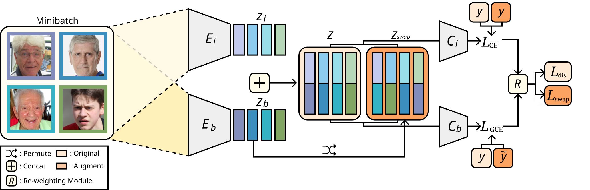
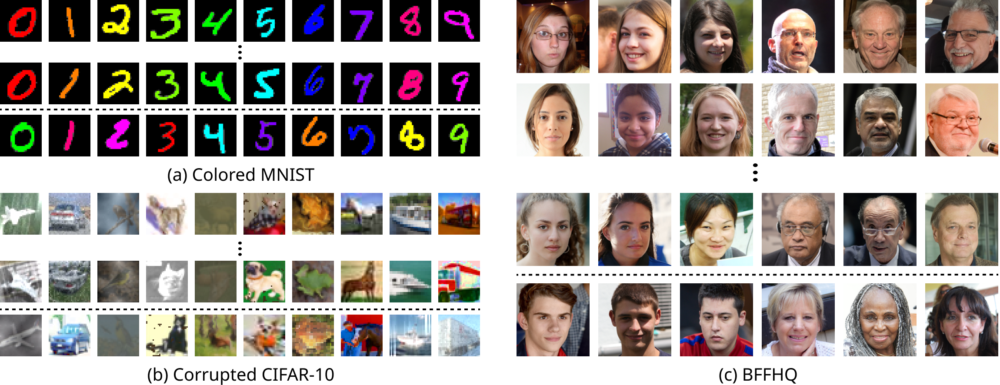

##  Learning Debiased Representation via Disentangled Feature Augmentation (Neurips 2021, Oral): Official Project Webpage
This repository provides the official PyTorch implementation of the following paper:
> Learning Debiased Representation via Disentangled Feature Augmentation <br>
> [Jungsoo Lee](https://leebebeto.github.io/)* (KAIST AI, Kakao Enterprise), [Eungyeup Kim](https://eungyeupkim.github.io/)* (KAIST AI, Kakao Enterprise),<br>
> [Juyoung Lee](https://sites.google.com/view/juyoung-lee) (Kakao Enterprise), [Jihyeon Lee](https://ginajihyeonlee.github.io/) (KAIST AI), and [Jaegul Choo](https://sites.google.com/site/jaegulchoo/) (KAIST AI) 
> <br>(* indicates equal contribution. The order of first authors was chosen by tossing a coin.)<br>
> NeurIPS 2021, Oral<br>

> Paper: [Arxiv](https://arxiv.org/abs/2107.01372) <br>

> **Abstract:** 
*Image classification models tend to make decisions based on peripheral attributes of data items that have strong correlation with a target variable (i.e., dataset bias).
These biased models suffer from the poor generalization capability when evaluated on unbiased datasets.
Existing approaches for debiasing often identify and emphasize those samples with no such correlation (i.e., bias-conflicting) without defining the bias type in advance.
However, such bias-conflicting samples are significantly scarce in biased datasets, limiting the debiasing capability of these approaches.
This paper first presents an empirical analysis revealing that training with "diverse" bias-conflicting samples beyond a given training set is crucial for debiasing as well as the generalization capability.
Based on this observation, we propose a novel feature-level data augmentation technique in order to synthesize diverse bias-conflicting samples. 
To this end, our method learns the disentangled representation of (1) the intrinsic attributes (i.e., those inherently defining a certain class) and (2) bias attributes (i.e., peripheral attributes causing the bias), from a large number of bias-aligned samples, the bias attributes of which have strong correlation with the target variable. 
Using the disentangled representation, we synthesize bias-conflicting samples that contain the diverse intrinsic attributes of bias-aligned samples by swapping their latent features.
By utilizing these diversified bias-conflicting features during the training, our approach achieves superior classification accuracy and debiasing results against the existing baselines on both synthetic as well as a real-world dataset.*<br>

<p align="center">
  
</p>

## Code Contributors
Jungsoo Lee [[Website]](https://leebebeto.github.io/) [[LinkedIn]](https://www.linkedin.com/in/jungsoo-lee-52103a17a/) [[Google Scholar]](https://scholar.google.com/citations?user=qSGLUDQAAAAJ&hl=ko) (KAIST AI, Kakao Enterprise) <br>
Eungyeup Kim [[Website]](https://eungyeupkim.github.io/) [[LinkedIn]](https://www.linkedin.com/in/eungyeup-kim-815718165/) [[Google Scholar]](https://scholar.google.com/citations?user=RtxkcwYAAAAJ&hl=en) (KAIST AI, Kakao Enterprise) <br>
Juyoung Lee [[Website]](https://sites.google.com/view/juyoung-lee) (Kakao Enterprise)

## Pytorch Implementation
### Installation
Clone this repository.
```
git clone https://github.com/kakaoenterprise/Learning-Debiased-Disentangled.git
cd Learning-Debiased-Disentangled
pip install -r requirements.txt
```
### Datasets
We used three datasets in our paper. 

<p align="center">
  
</p>

Download the datasets with the following [url](https://drive.google.com/drive/folders/1JEOqxrhU_IhkdcRohdbuEtFETUxfNmNT?usp=sharing).
Note that BFFHQ is the dataset used in "BiaSwap: Removing Dataset Bias with Bias-Tailored Swapping Augmentation" (Kim et al., ICCV 2021).
Unzip the files and the directory structures will be as following:
```
cmnist
 └ 0.5pct / 1pct / 2pct / 5pct
     └ align
     └ conlict
     └ valid
 └ test
```
```
cifar10c
 └ 0.5pct / 1pct / 2pct / 5pct
     └ align
     └ conlict
     └ valid
 └ test
```
```
bffhq
 └ 0.5pct
 └ valid
 └ test
```

### How to Run
#### CMNIST
##### Vanilla
```
python train.py --dataset cmnist --exp=cmnist_0.5_vanilla --lr=0.01 --percent=0.5pct --train_vanilla --tensorboard --wandb
python train.py --dataset cmnist --exp=cmnist_1_vanilla --lr=0.01 --percent=1pct --train_vanilla --tensorboard --wandb
python train.py --dataset cmnist --exp=cmnist_2_vanilla --lr=0.01 --percent=2pct --train_vanilla --tensorboard --wandb
python train.py --dataset cmnist --exp=cmnist_5_vanilla --lr=0.01 --percent=5pct --train_vanilla --tensorboard --wandb
```
```
bash scripts/run_cmnist_vanilla.sh
```

##### Ours
```
python train.py --dataset cmnist --exp=cmnist_0.5_ours --lr=0.01 --percent=0.5pct --curr_step=10000 --lambda_swap=1 --lambda_dis_align=10 --lambda_swap_align=10 --use_lr_decay --lr_decay_step=10000 --lr_gamma=0.5 --train_ours --tensorboard --wandb
python train.py --dataset cmnist --exp=cmnist_1_ours --lr=0.01 --percent=1pct  --curr_step=10000 --lambda_swap=1 --lambda_dis_align=10 --lambda_swap_align=10 --use_lr_decay --lr_decay_step=10000 --lr_gamma=0.5 --train_ours --tensorboard --wandb
python train.py --dataset cmnist --exp=cmnist_2_ours --lr=0.01 --percent=2pct  --curr_step=10000 --lambda_swap=1 --lambda_dis_align=10 --lambda_swap_align=10 --use_lr_decay --lr_decay_step=10000 --lr_gamma=0.5 --train_ours --tensorboard --wandb
python train.py --dataset cmnist --exp=cmnist_5_ours --lr=0.01 --percent=5pct  --curr_step=10000 --lambda_swap=1 --lambda_dis_align=10 --lambda_swap_align=10 --use_lr_decay --lr_decay_step=10000 --lr_gamma=0.5 --train_ours --tensorboard --wandb
```
```
bash scripts/run_cmnist_ours.sh
```

#### Corrupted CIFAR10
##### Vanilla
```
python train.py --dataset cifar10c --exp=cifar10c_0.5_vanilla --lr=0.001 --percent=0.5pct --train_vanilla --tensorboard --wandb
python train.py --dataset cifar10c --exp=cifar10c_1_vanilla --lr=0.001 --percent=1pct --train_vanilla --tensorboard --wandb
python train.py --dataset cifar10c --exp=cifar10c_2_vanilla --lr=0.001 --percent=2pct --train_vanilla --tensorboard --wandb
python train.py --dataset cifar10c --exp=cifar10c_5_vanilla --lr=0.001 --percent=5pct --train_vanilla --tensorboard --wandb
```
```
bash scripts/run_cifar10c_vanilla.sh
```

##### Ours
```
python train.py --dataset cifar10c --exp=cifar10c_0.5_ours --lr=0.0005 --percent=0.5pct --curr_step=10000 --lambda_swap=1 --lambda_dis_align=1 --lambda_swap_align=1 --use_lr_decay --lr_decay_step=10000 --lr_gamma=0.5 --train_ours --tensorboard --wandb
python train.py --dataset cifar10c --exp=cifar10c_1_ours --lr=0.001 --percent=1pct --curr_step=10000 --lambda_swap=1 --lambda_dis_align=5 --lambda_swap_align=5 --use_lr_decay --lr_decay_step=10000 --lr_gamma=0.5 --train_ours --tensorboard --wandb
python train.py --dataset cifar10c --exp=cifar10c_2_ours --lr=0.001 --percent=2pct --curr_step=10000 --lambda_swap=1 --lambda_dis_align=5 --lambda_swap_align=5 --use_lr_decay --lr_decay_step=10000 --lr_gamma=0.5 --train_ours --tensorboard --wandb
python train.py --dataset cifar10c --exp=cifar10c_5_ours --lr=0.001 --percent=5pct --curr_step=10000 --lambda_swap=1 --lambda_dis_align=1 --lambda_swap_align=1 --use_lr_decay --lr_decay_step=10000 --lr_gamma=0.5 --train_ours --tensorboard --wandb
```
```
bash scripts/run_cifar10c_ours.sh
```

#### BFFHQ
##### Vanilla
```
python train.py --dataset bffhq --exp=bffhq_0.5_vanilla --lr=0.0001 --percent=0.5pct --train_vanilla --tensorboard --wandb
```
```
bash scripts/run_bffhq_vanilla.sh
```

##### Ours
```
python train.py --dataset bffhq --exp=bffhq_0.5_ours --lr=0.0001 --percent=0.5pct --lambda_swap=0.1 --curr_step=10000 --use_lr_decay --lr_decay_step=10000 --lambda_dis_align 2. --lambda_swap_align 2. --dataset bffhq --train_ours --tensorboard --wandb
```
```
bash scripts/run_bffhq_ours.sh
```

### Pretrained Models
In order to test our pretrained models, run the following command.
```
python test.py --pretrained_path=<path_to_pretrained_ckpt> --dataset=<dataset_to_test> --percent=<percent_to_test>
```

We provide the pretrained models in the following urls. <br>
[CMNIST 0.5pct](https://drive.google.com/drive/folders/1HkbPXRShFcQMvkdXqc_ls2lEe8AKnx9k?usp=sharing) <br>
[CMNIST 1pct](https://drive.google.com/drive/folders/13myN-8IXJZXIydat9ou2R8hrofN6Fpjq?usp=sharing) <br>
[CMNIST 2pct](https://drive.google.com/drive/folders/1zGVY4A0VUF1B_2LAGFK8WGq6lZ9UbGbE?usp=sharing) <br>
[CMNIST 5pct](https://drive.google.com/drive/folders/1imLS2PoPnvN568vkNw58y4Nn6aOuQPKy?usp=sharing) <br>

[CIFAR10C 0.5pct](https://drive.google.com/drive/folders/19V4LyQLbDS6XKsDtSizcpf2xW3RExnve?usp=sharing) <br>
[CIFAR10C 1pct](https://drive.google.com/drive/folders/16vLSnPGfWt-AJ_7Z-0GPtE6nBU8DVFDl?usp=sharing) <br>
[CIFAR10C 2pct](https://drive.google.com/drive/folders/1wLOI04vergYKtHCPkXQazxifNHTI-BRN?usp=sharing) <br>
[CIFAR10C 5pct](https://drive.google.com/drive/folders/1zFU9saV4sVZ812FCKbORPrWD27CNc6sg?usp=sharing) <br>

[BFFHQ 0.5pct](https://drive.google.com/drive/folders/1VZ9y2gjUGQkgidvIsQGF3LaB8iMuupOR?usp=sharing)

### Citations

### BibTeX
```bibtex
@inproceedings{NEURIPS2021_disentangled,
 author = {Lee, Jungsoo and Kim, Eungyeup and Lee, Juyoung and Lee, Jihyeon and Choo, Jaegul},
 booktitle = {Advances in Neural Information Processing Systems},
 pages = {25123--25133},
 title = {Learning Debiased Representation via Disentangled Feature Augmentation},
 url = {https://proceedings.neurips.cc/paper/2021/file/d360a502598a4b64b936683b44a5523a-Paper.pdf},
 volume = {34},
 year = {2021}
}
```

### Contact
[Jungsoo Lee](mailto:bebeto@kaist.ac.kr)

[Eungyeup Kim](mailto:eykim94@kaist.ac.kr)

[Juyoung Lee](mailto:michael.jy@kakaoenterprise.com)

[Kakao Enterprise/Vision Team](mailto:vision.research@kakaoenterprise.com)

### Acknowledgments
This work was mainly done when both of the first authors were doing internship at Vision Team/AI Lab/Kakao Enterprise. 
Our pytorch implementation is based on [LfF](https://github.com/alinlab/LfF).
Thanks for the implementation.
